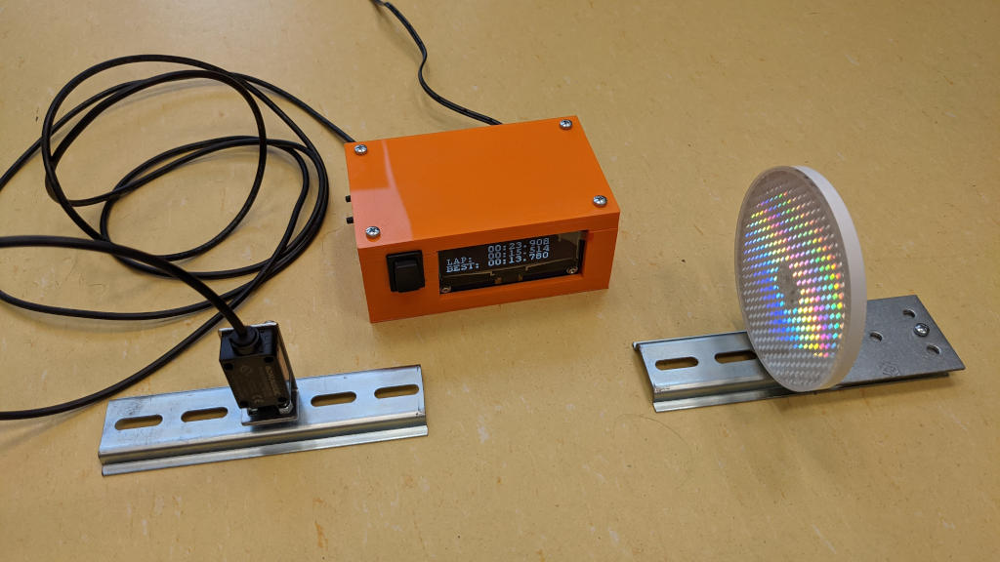

# F1Tenth Scoreapp

**F1Tenth Scoreapp** is a complete solution for measuring lap time on a racing track, which was developed for [International F1/10 Autonomous Racing Competition](https://f1tenth.org/).

This project consists of several parts:
1. [frontend](./frontend/) (client-side React.js app)
2. [backend](./backend/) (Go server providing REST and WebSocket APIs)
3. [backend-arrowhead](./backend-arrowhead/) (Arrowhead Compliant overlay for launching the backend)
4. [optical barrier code and design](./barrier/) (KiCAD, C, Czech)
5. [barrier-arrowhead](./barrier-arrowhead/) (Arrowhead Compliant overlay for the optic barrier)

## License

F1tenth Scoreapp is released under the **GPLv3** license.

## About Arrowhead Tools

This project has been developed by [Industrial Informatics Department](https://iid.ciirc.cvut.cz/) that is a part of [Czech Institute of Informatics, Robotics and Cybernetics](https://ciirc.cvut.cz/), Czech Technical University in Prague. It has received funding from the EU ECSEL Joint Undertaking and the Ministry of Education of the Czech Republic under grant agreement n° 826452 and 8A19011 (project Arrowhead Tools).

The [Arrowhead Tools](https://arrowhead.eu/arrowheadtools) project aims for digitalisation and automation solutions for the European industry, which will close the gaps that hinder the IT/OT integration by introducing new technologies in an open source platform for the design and run-time engineering of IoT and System of Systems. The project will provide engineering processes, integration platform, tools and tool chains for the cost-efficient development of digitalisation, connectivity and automation system solutions in various fields of application.
